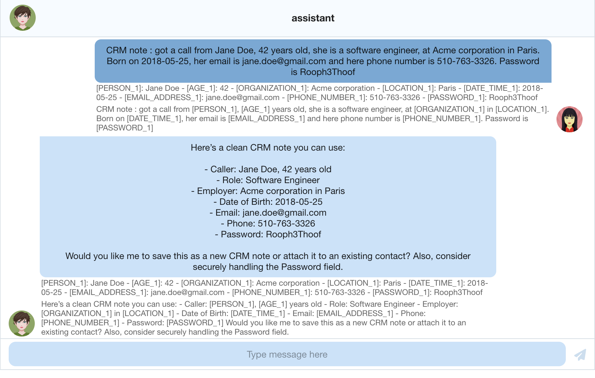

# AI Chat Pseudonymizer

Proof of concept for an AI chatbot that detects and pseudonymizes PII in the browser before sending text to the AI API. Original values stay on the client; only placeholders reach the backend.

This is a POC, not a production privacy system.

## Current status

The chat UI, GraphQL API, Redux store, client-side PII detection, and **streaming** OpenAI replies are in place.

1. Detect PII in the browser with [`onnx-community/bert-small-pii-detection-ONNX`](https://huggingface.co/onnx-community/bert-small-pii-detection-ONNX) via Transformers.js.
2. Replace entities with placeholders such as `[PERSON_1]` and `[EMAIL_ADDRESS_1]`.
3. Keep the mapping in Redux; send only pseudonymized text to the backend.
4. Subscribe over WebSocket. The server streams OpenAI (`gpt-5-nano`) tokens. Conversation context stays on OpenAI via `previous_response_id`.
5. Show **decoded** text in the bubbles (the working-chat experience). The footer lists `placeholder → original`, then the coded payload that was sent or received.

The first message can be slow while the browser downloads the ONNX model.

## Stack

**Frontend:** React, TypeScript, Create React App, Redux Toolkit, Apollo Client, ChatScope, Transformers.js, graphql-ws

**Backend:** Node.js 22, TypeScript, Express, Apollo Server, GraphQL, OpenAI SDK, graphql-ws

No database. Chat state and PII mappings live in Redux on the client.

## Getting started

Requires [Node 22](https://nodejs.org/) (see `.nvmrc`).

```bash
npm install
cp .env.example .env
npm run dev
```

Set `OPENAI_API_KEY` in `.env`. The server uses it to call OpenAI.

- App: [http://localhost:3000](http://localhost:3000)
- GraphQL: [http://localhost:4000/graphql](http://localhost:4000/graphql)
- Subscriptions: `ws://localhost:4000/subscriptions`

### Scripts

| Command          | Description                                                                    |
| ---------------- | ------------------------------------------------------------------------------ |
| `npm run dev`    | Start GraphQL server and React app together                                    |
| `npm run server` | Start Apollo Server on port 4000 (`tsx watch` restarts when `server/` changes) |
| `npm start`      | Start the React app on port 3000 (CRA already hot-reloads `src/`)              |
| `npm run build`  | Production build of the frontend                                               |


## How to use

The PII model labels are:

```
AGE, COORDINATE, CREDIT_CARD, DATE_TIME, EMAIL_ADDRESS, FINANCIAL, IBAN_CODE, IMEI, IP_ADDRESS, LOCATION, MAC_ADDRESS, NRP, ORGANIZATION, PASSWORD, PERSON, PHONE_NUMBER, TITLE, URL, US_BANK_NUMBER, US_DRIVER_LICENSE, US_ITIN, US_LICENSE_PLATE, US_PASSPORT, US_SSN
```

Per-label scores: [model evaluation](https://huggingface.co/onnx-community/bert-small-pii-detection-ONNX#evaluation). A small BERT will miss some spans. This is synthetic test data only.

**Sample message** (paste into the chat):

```
CRM note: got a call from Jane Doe, 42 years old, she is a software engineer at Acme Corporation in San Francisco. Born on 2018-05-12. Email is jane.doe@example.com, and phone number 510-763-3326. Password is Rooph3Thoof.
```




## What can be improved

**Placeholders can interfere with the assistant.** Sometimes the personal detail is the task. “What is the weather in Paris?” fails if `Paris` becomes `[LOCATION_1]`. A real product would let the user opt in or out, or choose per type (code emails, leave city names).

**Detection is a single small NER pass.** The BERT misses names, non-English text, and messy messages. Worth considering a regex second pass for emails/phones, and refuse to send when confidence is low.

**The mapping only lives in Redux** The mapping does not persist after a refresh. It might be ideal to flush all personal information for one time operations, but it does not fit a conversation workflow. Saving history would need an encrypted client vault (IndexedDB / passphrase).

**No conversation memory** A real product would keep the pseudonymized messages in the backend, in order to keep conversation memory.

**Placeholder format is too simple.** `[EMAIL_ADDRESS_1]` is easy to collide with markdown, citations, and user-typed brackets. A reserved token alphabet, round-trip tests, and treating an unknown placeholder in the reply as an error would be more robust.
